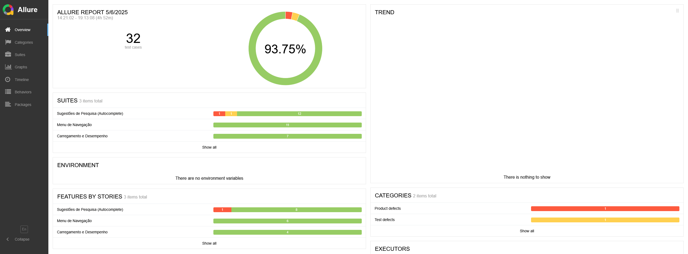

# Projeto de Automação de Testes - Amazon.com.br

Este projeto implementa testes automatizados para a página inicial da Amazon.com.br, focando nas funcionalidades de sugestões de pesquisa (autocomplete), menu de navegação e desempenho de carregamento.

## Tecnologias Utilizadas

- Java 11
- Maven
- Playwright
- Cucumber (BDD)
- Allure Reports
- Docker
- GitHub Actions

## Estrutura do Projeto

O projeto segue uma arquitetura Page Object Model (POM) com BDD:

- `src/main/java`: Classes principais do framework
  - `pages`: Classes de Page Objects
  - `config`: Configurações do projeto
  - `utils`: Classes utilitárias

- `src/test/java`: Classes de teste
  - `stepdefinitions`: Implementações dos passos do Cucumber
  - `runners`: Classes para execução dos testes
  - `utils`: Utilitários específicos para testes

- `src/test/resources`: Recursos para testes
  - `features`: Arquivos .feature com cenários BDD
  - Arquivos de configuração

## Funcionalidades Testadas

### 1. Sugestões de Pesquisa (Autocomplete)
- Verificação de exibição de sugestões ao digitar
- Validação da relevância das sugestões
- Testes com diferentes termos de pesquisa
- Cenários negativos (termos inválidos, campo vazio)

### 2. Menu de Navegação
- Funcionalidade do menu hamburger
- Responsividade em diferentes tamanhos de tela
- Exibição de categorias e departamentos

### 3. Carregamento e Desempenho
- Tempo de carregamento da página
- Coleta de métricas de desempenho
- Testes em diferentes tamanhos de tela

## Executando os Testes

### Pré-requisitos
- Java 11+
- Maven
- Docker (opcional)

### Execução Local

#### Instalação de Dependências

\`\`\`bash
# Instalar dependências
mvn clean install
\`\`\`

#### Instalação dos Navegadores do Playwright

**Windows (PowerShell):**
\`\`\`powershell
mvn exec:java "-Dexec.mainClass=com.microsoft.playwright.CLI" "-Dexec.args=install --with-deps"
\`\`\`

**Linux/Mac ou Windows com Git Bash:**
\`\`\`bash
mvn exec:java -Dexec.mainClass="com.microsoft.playwright.CLI" -Dexec.args="install --with-deps"
\`\`\`

**Ou use os scripts fornecidos:**
- Windows: `install-browsers.bat`
- Linux/Mac: `install-browsers.sh`

### Executando com Navegadores Visíveis (Modo Não-Headless)

#### Windows (PowerShell):

\`\`\`powershell
# Executar com navegador visível (Chromium)
mvn test "-Dbrowser.headless=false" "-Dbrowser.type=chromium"

# Executar com Firefox visível
mvn test "-Dbrowser.headless=false" "-Dbrowser.type=firefox"

# Executar com WebKit visível
mvn test "-Dbrowser.headless=false" "-Dbrowser.type=webkit"

# Executar com navegador específico e tags específicas do Cucumber
mvn test "-Dbrowser.headless=false" "-Dbrowser.type=chromium" "-Dcucumber.filter.tags=@positivo"
\`\`\`

**Ou use os scripts fornecidos:**
- `run-chromium.bat`
- `run-firefox.bat`
- `run-webkit.bat`

#### Linux/Mac ou Windows com Git Bash:

\`\`\`bash
# Executar com navegador visível (Chromium)
mvn test -Dbrowser.headless=false -Dbrowser.type=chromium

# Executar com Firefox visível
mvn test -Dbrowser.headless=false -Dbrowser.type=firefox

# Executar com WebKit visível
mvn test -Dbrowser.headless=false -Dbrowser.type=webkit

# Executar com navegador específico e tags específicas do Cucumber
mvn test -Dbrowser.headless=false -Dbrowser.type=chromium -Dcucumber.filter.tags="@positivo"
\`\`\`

**Ou use os scripts fornecidos:**
- `run-chromium.sh`
- `run-firefox.sh`
- `run-webkit.sh`

#### Configuração Permanente

Você também pode modificar permanentemente as configurações no arquivo `src/test/resources/config.properties`:

\`\`\`properties
# Altere para false para ver o navegador durante a execução
browser.headless=false

# Escolha o navegador: chromium, firefox ou webkit
browser.type=chromium
\`\`\`

### Execução com Docker

\`\`\`bash
# Construir a imagem e executar os testes
docker-compose up --build
\`\`\`

Nota: Para execução com Docker, os testes sempre rodarão em modo headless, pois não há interface gráfica no container.

## Solução de Problemas Comuns

### Problemas com PowerShell no Windows

Se você encontrar erros como `Unknown lifecycle phase ".headless=false"` ao executar comandos Maven no PowerShell, certifique-se de colocar os parâmetros entre aspas duplas:

\`\`\`powershell
mvn test "-Dbrowser.headless=false" "-Dbrowser.type=firefox"
\`\`\`

### Navegadores não instalados

Se você encontrar erros relacionados a navegadores não encontrados, execute o comando de instalação dos navegadores:

\`\`\`powershell
# Windows (PowerShell)
mvn exec:java "-Dexec.mainClass=com.microsoft.playwright.CLI" "-Dexec.args=install --with-deps"
\`\`\`

### Problemas de permissão no Linux/Mac

Se você encontrar problemas de permissão ao executar os scripts .sh:

\`\`\`bash
chmod +x *.sh
./install-browsers.sh
\`\`\`

## Relatórios
- Gerando relatório Allure: `mvn allure:report`
- Abrindo relatório no navegador: `mvn allure:serve` 
Após a execução dos testes, os relatórios estarão disponíveis em:

- Relatório Allure: `target/allure-report`
- Relatório Cucumber: `target/cucumber-reports`
- Screenshots: `target/screenshots`
- Logs: `target/logs`

## Integração Contínua

O projeto está configurado para executar automaticamente no GitHub Actions:
- A cada push ou pull request para a branch main/master
- Diariamente à meia-noite (cron job)

## Estratégia de Teste

- **Testes Funcionais**: Verificam se as funcionalidades atendem aos requisitos
- **Testes de Responsividade**: Garantem que a interface funcione em diferentes dispositivos
- **Testes de Desempenho**: Avaliam o tempo de carregamento e métricas de performance
- **Cenários Positivos e Negativos**: Cobrem tanto fluxos esperados quanto comportamentos de erro

## Boas Práticas Implementadas

- **Código Limpo**: Seguindo princípios SOLID e padrões de design
- **Reutilização**: Componentes modulares para maximizar reuso
- **Relatórios Detalhados**: Documentação clara dos resultados de teste
- **Execução Paralela**: Configuração para execução em múltiplos ambientes
- **Gestão de Dados de Teste**: Abordagem estruturada para dados de teste

## Relatório Allure



## Conclusão

Este projeto fornece uma estrutura robusta para testes automatizados da página inicial da Amazon.com.br, permitindo identificar problemas de funcionalidade, usabilidade e desempenho. A combinação de Playwright com Cucumber permite testes eficientes e legíveis, enquanto o Allure fornece relatórios detalhados para análise.

\`\`\`

```batch file="install-browsers.bat"
@echo off
echo Instalando navegadores do Playwright...
mvn exec:java "-Dexec.mainClass=com.microsoft.playwright.CLI" "-Dexec.args=install --with-deps"
echo Instalação concluída!
pause
